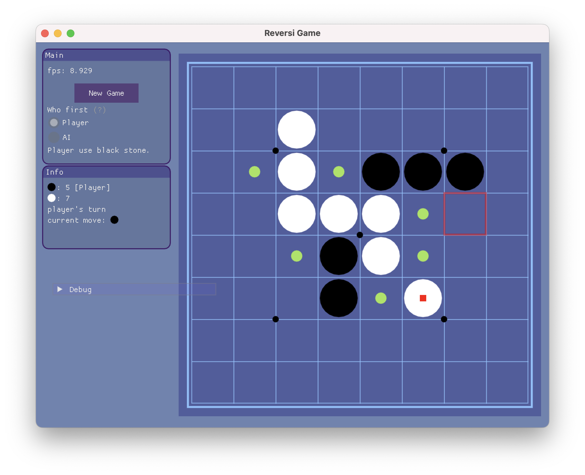

# Reversi Game

A Reversi (Othello) game implementation with an AI opponent powered by Monte Carlo Tree Search (MCTS) algorithm. Built with C++17, SDL2, and Dear ImGui for a modern graphical interface.



## Features

- **Graphical User Interface**: Clean and intuitive UI built with Dear ImGui
- **AI Opponent**: Intelligent computer player using Monte Carlo Tree Search algorithm
- **Customizable Board**: Configurable board size (default 8x8)
- **Performance Optimized**: Idle frame rate optimization to reduce CPU usage

## Game Rules

Reversi (also known as Othello) is a strategy board game for two players. The game is played on an 8×8 board with pieces that are black on one side and white on the other.

- Players take turns placing pieces on the board
- A valid move must flank one or more opponent pieces between the newly placed piece and another piece of the player's color
- All flanked opponent pieces are flipped to the player's color
- If a player cannot make a valid move, their turn is skipped
- The game ends when neither player can make a valid move
- The player with the most pieces of their color wins

## Requirements

- **CMake** 3.20 or higher
- **C++17** compatible compiler
- **SDL2** library
- **OpenGL** support
- **yaml-cpp** (automatically fetched via CMake)

### Platform-Specific Requirements

- **macOS**: Xcode Command Line Tools or similar development environment
- **Linux**: GCC/Clang with C++17 support, SDL2 development packages
- **Windows**: Visual Studio 2017 or later, or MinGW with C++17 support

## Building the Project

### Clone the Repository

```bash
git clone https://github.com/maojh15/ReversiGame.git
cd ReversiGame
```

### Install Dependencies

#### macOS
```bash
brew install sdl2 cmake
```

#### Ubuntu/Debian
```bash
sudo apt-get install libsdl2-dev cmake build-essential
```

#### Fedora
```bash
sudo dnf install SDL2-devel cmake gcc-c++
```

### Build

```bash
mkdir build
cd build
cmake ..
make
make install
```

The executable will be installed in the `bin` directory.

### Run

```bash
cd bin
./main
```

## Configuration

The game can be customized through the `config.yaml` file:

```yaml
board_size: 8

ui:
  background_col: [0.429, 0.517, 0.696]  # RGB values (0-1)
  board_fill_col: [0.311, 0.366, 0.623]
  line_col: [0.539, 0.770, 1.0]
  hint_valid_move_col: [0.635, 0.892, 0.345]
  hint_mouse_pos_col: [1.0, 0.0, 0.0]
```

### Configuration Options

- **board_size**: Size of the game board (default: 8)
- **background_col**: Background color in RGB format (values 0-1)
- **board_fill_col**: Board background color
- **line_col**: Grid line color
- **hint_valid_move_col**: Color for valid move indicators
- **hint_mouse_pos_col**: Color for mouse position highlighting

You can also modify colors in real-time using the in-game color picker and save the configuration using the "dump config" button.

## Project Structure

```
ReversiGame/
├── src/
│   ├── game/
│   │   ├── reversi_game.h/cpp       # Main game logic
│   │   ├── monte_carlo_tree_search.h/cpp  # MCTS AI implementation
│   │   ├── game_ui.h/cpp            # UI rendering
│   │   └── game_const.h             # Game constants
│   ├── imgui/                       # Dear ImGui library
│   ├── pgbar/                       # Progress bar utilities
│   ├── main.cpp                     # Application entry point
│   ├── impl_sdl2.h/cpp              # SDL2 implementation
│   └── imgui_idle_optimizer.h       # Frame rate optimization
├── fig/
│   └── screen_shot.png              # Screenshot
├── CMakeLists.txt                   # Build configuration
├── config.yaml                      # Game configuration
└── README.md                        # This file
```

## How to Play

1. **Start a New Game**: Click the "New Game" button in the main panel
2. **Make a Move**: Click on any highlighted valid position on the board
3. **Player Turn**: The game indicates whose turn it is (player or AI)
4. **AI Thinking**: When it's the AI's turn, the game will display "AI is thinking..."
5. **Game Over**: The game ends when no valid moves are available for either player
6. **Winner**: The player with the most pieces wins

### Controls

- **Mouse Click**: Place a stone on a valid position
- **Q Key**: Quit the game
- **New Game Button**: Start a new game
- **Reload Config Button**: Reload configuration from file
- **Dump Config Button**: Save current configuration to `dump_config.yaml`

## AI Implementation

The AI opponent uses **Monte Carlo Tree Search (MCTS)**, a powerful algorithm for game playing that:

1. **Selection**: Traverses the game tree using UCB1 (Upper Confidence Bound) formula
2. **Expansion**: Expands the tree by adding new nodes for unexplored moves
3. **Simulation**: Performs random playouts from the new position
4. **Backpropagation**: Updates statistics for all nodes in the path

The MCTS algorithm balances exploration and exploitation to find strong moves. The number of simulations can be configured (default: 10,000 iterations).

### MCTS Statistics

During AI thinking, the following statistics are printed to the console:
- Number of nodes in the search tree
- Maximum depth of the tree
- Number of nodes at each depth level

## Technical Details

### Dependencies

- **SDL2**: Cross-platform multimedia library for window management and input
- **OpenGL**: Graphics rendering
- **Dear ImGui**: Immediate mode GUI library
- **yaml-cpp**: YAML parser and emitter (v0.8.0)

### Build System

- **CMake**: Cross-platform build system
- **C++17**: Modern C++ standard with features like structured bindings
- **RPATH**: Configured for proper dynamic library loading on macOS

### Performance Features

- **Idle Optimization**: Reduces frame rate when no user input is detected
- **Threaded AI**: AI computation runs in a separate thread to keep UI responsive
- **Efficient Board Representation**: Uses 2D vectors for fast board state manipulation

## Development

### Code Style

The project follows modern C++ practices:
- RAII for resource management
- Smart pointers for memory safety
- Const correctness
- Structured bindings (C++17)

### Adding Features

To extend the game:

1. **Modify Game Logic**: Edit `src/game/reversi_game.cpp`
2. **Update UI**: Modify `src/game/game_ui.cpp`
3. **Adjust AI**: Tune MCTS parameters in `src/game/monte_carlo_tree_search.cpp`
4. **Add Configuration**: Update `config.yaml` and corresponding load/dump functions

## Troubleshooting

### SDL2 Not Found

If CMake cannot find SDL2:
- Ensure SDL2 is installed in a standard location
- Set `SDL2_DIR` environment variable to SDL2 installation path
- Modify `findsdl2dir.cmake` if needed

### Build Errors

- Ensure you have a C++17 compatible compiler
- Check that all dependencies are installed
- Try cleaning the build directory: `rm -rf build && mkdir build`

### Runtime Issues

- Verify `config.yaml` exists in the same directory as the executable
- Check console output for error messages
- Ensure OpenGL drivers are up to date

## Credits

- **ImGui**: [Dear ImGui](https://github.com/ocornut/imgui) by Omar Cornut
- **yaml-cpp**: [yaml-cpp](https://github.com/jbeder/yaml-cpp) by Jesse Beder
- **SDL2**: [Simple DirectMedia Layer](https://www.libsdl.org/)
- **tqdm**: [tqdm](https://github.com/aminnj/cpptqdm.git) by Nick Amin

## Contributing

Contributions are welcome! Please feel free to submit pull requests or open issues for bugs and feature requests.


